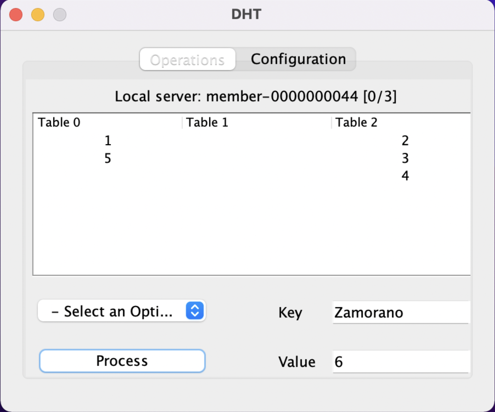
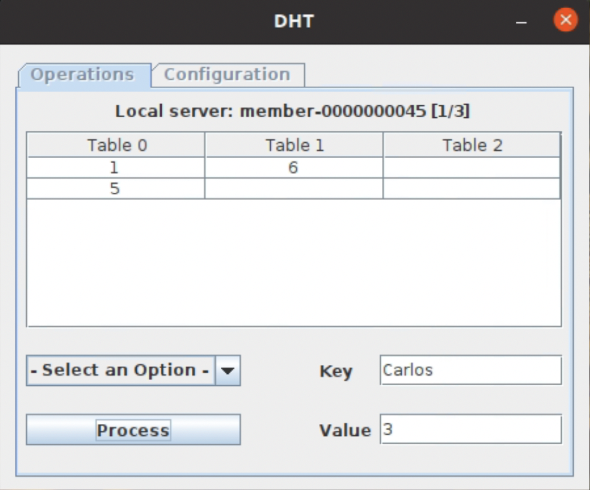

# DHT Server Management
In order to manage the creation and failure of DHT servers, the persistent znode “members” is defined. Processes are added as ephemeral children of the previous node. A watch is set using the getChildren method that fires when a child of “/members” is created or deleted. When one of these events occurs, the configuration of the DHT is updated.

# DHT Operations Management
The operations that are executed on the DHT are represented in a znode “operations”. Each ephemeral child of this node contains an OperationsDHT object. A watch is set on the “/operations” node for the cluster to detect when there is a pending operation. OperationsDHT contains a field “destinationMember”, when the servers check the znodes created under “/operations”, they inspect this field to know which server has to process each operation. After a server has processed an operation, it deletes the corresponding node.

# Fault Tolerance
Fault management is accomplished by using the member management process described previously. Given that the tables are replicated, when a server that has failed starts again, the corresponding tables are transferred. This features uses the distributed coordination provided by ZooKeeper.
When a server starts, it creates a znode “/ip_addresses”, a watch on it, and a child node containing an IP_Object object. This object has as fields the IP address of the server and its name in “/members”. A server is then started that listens on the port 5217, in order to receive the tables. Once the rest of the servers in the DHT cluster detect that a node has been created in “/ip_addresses”, they connect to the new server and send the tables. After the server has received the tables, it deletes the znode that contains its IP.

# Test Procedure
### Prerequisites
- Start ZooKeeper in standalone or quorum mode

### Referenced Libraries
The referenced libraries are the ones from ZooKeeper (apache-zookeeper-x.x.x-bin/lib). This app has been tested with ZooKeeper-3.6.3.

### Running the app

The application can be executed using the command “java dht.MainUI” after exporting the JAR file. The following nuances should be taken into account:

- Execution without arguments

  By default, the connection to ZooKeeper is configured using the loopback address 127.0.0.1 and port 2181. It’s not possible to access the “Configuration” tab.

- Execution with one argument (any value)

  When the application starts, it shows the “Configuration” tab, the “Operations” tab will remain disabled until the “Start DHT” button is clicked. In the “Configuration” tab, the text field is used to configure the servers that make up the ZooKeeper ensemble. The format is `IP1:Port1;IP2:Port2` (separated by semicolons). Each DHT server will connect to a random ZooKeeper server.

# User interface

The tables are updated automatically when values are inserted or removed. Values are shown in ascending order, regardless of insertion order. The application has been tested
in MacOS and Ubuntu, being the graphical interface different, as shown below:

- MacOS

- Ubuntu

“Local server” shows the name of the local server, i.e., the name of the child znode of “/members” in ZooKeeper. Inside the bracket, the first number indicates the position of the server within the list of servers, and the second number shows the number of servers that make up the DHT at any given time.
